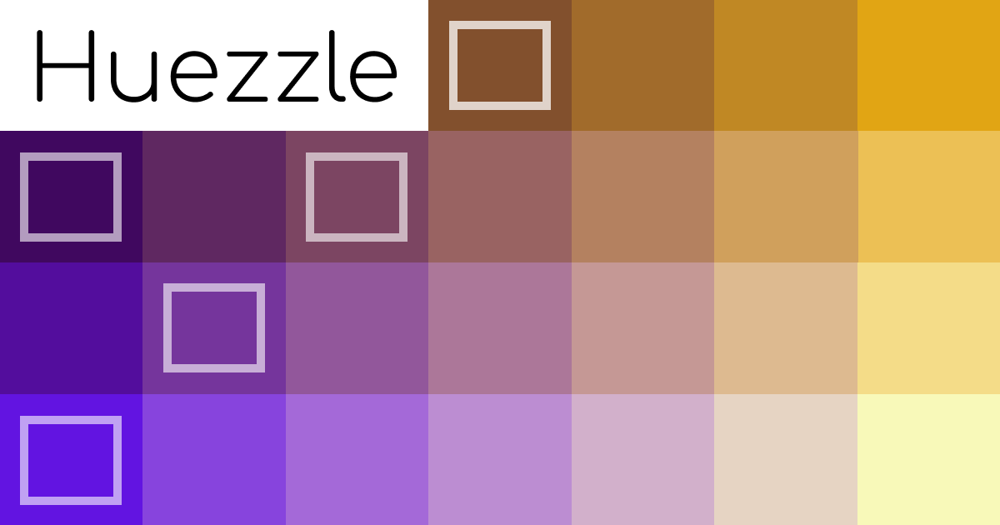

Huezzle is a game where you'll face a different color-full puzzle every day. You'll enjoy various colors, sizes, and
patterns of frozen cells. **Reorder the colored cells, leave them as they were at the beginning**.


Try to relax and challenge yourself every day, delight your eyes and your brain with combinations of vibrant colors.
Ask for up to 3 hints if you feel stuck. Check your best times in the statistics section and **share your daily results
with your friends and family** to prove that you're the best.


It can be played on any browser-enabled device and does not require an internet connection. It offers multiple options
such as control modes, animation speed, light/dark mode, languages, etc., to suit your needs.

## Project

It's developed in Vue 3 and TypeScript, with the support of many other libraries and technologies including Sass, Jest,
Storybook, Luxon, seedrandom.js, and Color.js.

## Setup

To ensure game stability, it's recommended to use nvm to utilize the same version of *Node*. A `.nvmrc` file has been
included specifying the required version. Additionally, the `yarn.lock` file is included to ensure consistent dependency
versions. Therefore, using *Yarn* as a package manager instead of *npm* is also recommended.
```bash
nvm use
yarn install
```

### Compiles and hot-reloads for development
```bash
yarn dev
```

### Compiles and minifies for production
```bash
yarn build
```

### Lints and fixes files
```bash
yarn lint
```

### Runs type checking
```bash
yarn typecheck
```

### Run your unit tests
```bash
yarn test
```

### Run last three commands (linter, type checking and tests)
```bash
yarn belial
```